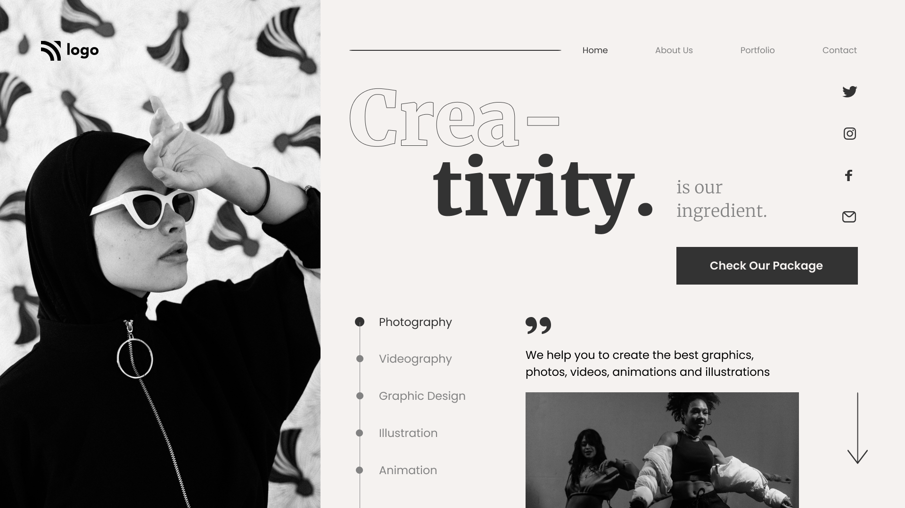

# UI-LiveClassProject14
This project is a part of **HTML|CSS** portion of Full Stack Javascript Web Developer Bootcamp by **Hitesh Chaudhary** @Ineuron

## [GO LIVE](https://ui-project14.netlify.app/)
***

# What I have Learned in this Project.

In this project I have learned about **Flex** and **CSS Positioning**.

It took me about 5-7 hours with lots of research from **MDN Reference** and **Google** to complete this project.
